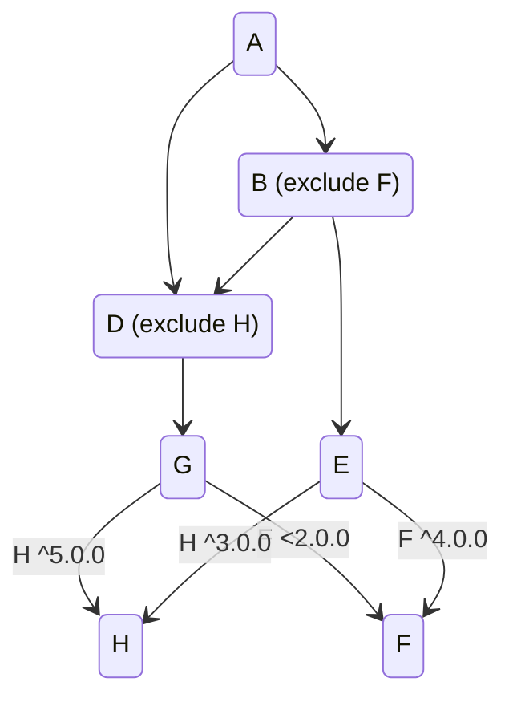

# A Heading

A markdown file containing an embedded Mermaid graph.
Here is a [link](https://www.cthing.com).

* Item 1
* Item 2

```mermaid
%% Comment 1
stateDiagram-v2
    state "B (exclude F)" as B
    state "D (exclude H)" as D
    A --> B
    A --> D
    B --> E
    B --> D
    D --> G
    
    %% Comment 2
    G --> H: H ^5.0.0
    G --> F: F <2.0.0
    E --> H: H ^3.0.0
    E --> F: F ^4.0.0
```
The above graph is embedded.
